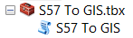
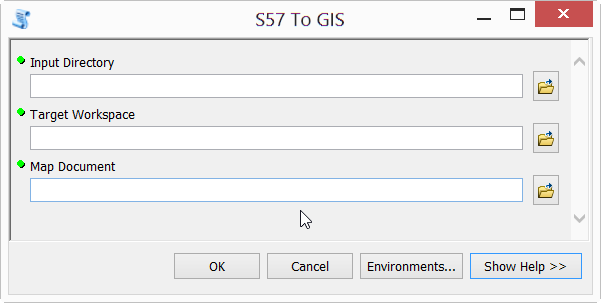

# S57 To GIS

S57 to GIS is a python script that allows you to quickly and easily load one, or many, ENC cells into a
geodatabase that is symbolized with S-52.

Tool requirements:
* ArcMap 10.4.1 with ArcGIS for Maritime: Charting 10.4.1
* Ensure that the Maritime Charting extension is enabled
* The S57 To GIS.tbx and s57_to_gis Python file must be in the same directory

Overview of materials provided:
* S57 To GIS.tbx – toolbox containing the python script
* s57_to_gis– configurable Python script file.
* NO_SCAMIN_TEMPLATE.mxd – map document with layers and labels preset for S-52 rendering.
* SCAMIN_TEMPLATE.mxd – map document with 5 scaleband-based group layers preset for S-52 rendering. The scaleband-based group layers turn on and off as you zoom in and out, providing Bing/Google maps style drawing behavior in the map document.
* S57_GIS.gdb – A preconfigured geodatabase template schema.

Overview of tool functions:
* This script iterates through the contents of the **Input Directory** parameter and finds all S-57 cells and their associated updates.
* The list of cells is then imported into the workspace defined in the **Target Workspace** parameter.
* Once the import process is complete, the script calculates S-52 on the geodatabase
* Lastly, the script resources the feature classes from the Target Workspace to the map document selected in the **Map Document** parameter. It also zooms the data frame in the map document to the extent of all of all the Meta polygon features (M_QUAL, for example).

# Steps to use S57 To GIS

Note: Each time you want to use the tool, make a copy of the S57_GIS.gdb and one of the provided map
documents, keeping the originals as a template that can be reused. 

1. Open ArcMap
2. In ArcMap, open the ArcCatalog window and navigate to the location of the S57 To GIS.tbx.
3. Expand **S57 To GIS.tbx**

4. Double click the S57 To GIS tool to open it.

5. For the **Input Directory**, browse to the location of the cells(s) you want to import

Note: The cells in the input directory can be in either the US or International exchange set
format, or they can simply be contained under the Input Directory in no particular structure.
6. For the **Target Workspace**, browse to the location of the geodatabase you want to import into.

Note: The geodatabase needs to contain the correct schema to receive the data. Download the file **S57_GIS.zip** from this repository, and unzip it. It contains the schema required and can be used as the **Target Workspace**.
7. For **Map Document**, choose a template map document for visualizing the output.
8. Click OK
The cells are imported, the data is symbolized, and the map document is resourced and zoomed
to the target workspace data.
