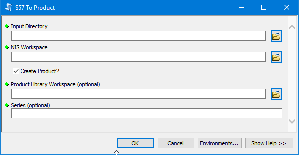

# S57 To Product

S57 To Product is a python script that makes importing ENC data and creating official ENC products with ArcGIS simple and fast.

The tool performs the following functions
* The script iterates through the folder defined in **Input Directory** and imports all the ENCs and updates from that directory into the geodatabase defined in the **NIS Workspace** parameter.
* The script then iterates through all the ENC base cells found in the **Input Directory** and uses them to create products in the Product Library defined by the **Product Library Workspace** parameter, under the Series defined by the **Series** parameter.

# Steps to use S57 To Product

1. Open ArcMap
2. From the Main menu toolbar, clock Customize>Production>Product Library
3. The Product Library dockable window appears
4. Right click on the top node in the Product Library and choose Select Product Library
5. Navigate to the location of your Product Library database and select it.
6. In the Product Library window, expand Product Library > Products > Nautical > ENC
7. Right click on the ENC node and choose Properties
The Class Properties dialog appears
8. Click Nautical Environment from the left pane of the Class Properties dialog
9. Under Nautical Information System (NIS), click the ellipses next to the Workspace property and browse to the location of your NIS geodatabase
Your NIS is now set at the Class level and any products

**Note:** You must set the NIS Workspace property before you create any Series under the ENC class if you want the Series to automatically inherit the NIS set at the Class level.

10. Open the ArcCatalog window in ArcMap and navigate to the location of the **S57 To Product.tbx.**
11. Expand the S57 To Product.tbx

12. Double click **S57 To Product** to open the tool.

13. For **Input Directory**, browse to the directory that contains the ENC cells you want to use to define your products and populate your NIS.
14. For the **Product Library Workspace**, browse to the location of your Product Library.
After you define the Product Library Workspace, the Series parameter will populate with a dropdown list of available Series in the Product Library.
15. From the **Series** parameter dropdown, choose a Series to create the products under.
16. For the **NIS Workspace**, browse to the location of your NIS.

The products are created in the Product Library and the cells are imported into the NIS.
