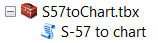
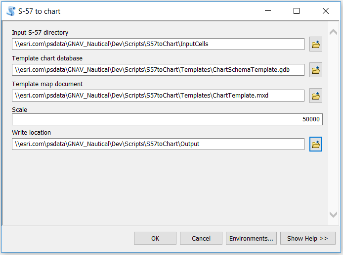

# S57 To Chart

# What is S57toChart

S57toChart is a python script tool that takes an S-57 ENC file and outputs a paper chart map document.
The tool performs the following functions:
* Imports an S-57 ENC cell into a file geodatabase
* Imports an S-57 ENC cell into a file geodatabase
* Creates INT2 grids and graticules
* Converts labels to annotation
* Eliminates symbology conflicts
* Creates a Zone of Confidence diagram
* Calculates INT1 symbology
Some caveats for this tool are:
* It requires ArcGIS Desktop and ArcGIS for Maritime Charting version 10.4.1.
* It does not generate masks for annotation –typically, a cartographer may want to modify the results of the automated text placement before generating the masks. If masks are desired, the Mask Annotation process can be run from the Chart Automation tool.
* It does not generate light sectors. Light sectors can be created with the Generate Light Sectors tool if desired.
* It works best with rectangular cells– rectangular datasets are much easier to naturally fit on a rectangular sheet without manual intervention. Of course, the automation will run regardless of the shape of the data coverage. However, the results may not be ideal.
* The tool works best with cells that do not contain multiple compilation scales of data – it will still process data regardless of scale, but it processes all data with the single user defined Scale parameter value, so the output may not be ideal. The tool does not generalize, or thin, data.
* You must have background processing (Geoprocessing options) disabled.

# Steps to use S57toChart
1. Copy the entire S57toChart folder and paste to your machine.
2. Open ArcMap.
3. In ArcCatalog, navigate to the location you copied the tool to on your machine.
4. Expand S57toChart.tbx. 
   
5. Open -> S57 to chart. 
  **Note:**: If you copied the S57toChart folder directly under your C drive, the parameters are automatically set for you. 
   
  For the Input S-57 directory, browse to the folder that contains the S-57 ENC that will be used to
  create the chart. 
**Note:**: A sample cell is provided for you. If there are multiple cells in the directory, they will all be
  imported into the geodatabase. 
7. Navigate to the location of the template database. 
  **Note:**: A template database is provided for you. This database will be copied by the tool, leaving
  the original template for future use. 
8. For the template map document, browse to the mxd that will be used to create the chart. 
  **Note:**: A template mxd is provided for you. The template map document will be copied by the
  tool, leaving the original template for future use. 
9. Type a scale for the chart. The value you enter will be used as the reference scale for the chart. 
10. Browse to a Write location and type a name for the output folder that will be created as the
output directory. 
11. Click OK 
The directory defined in the Write location parameter is created and the chart database and map
document are generated there. 
12. Open the map document that is generated in the Write location directory to view the results.
